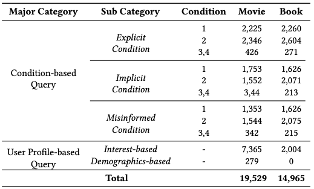

# Towards Next-Generation Recommender Systems: A Benchmark for Personalized Recommendation Assistant with LLMs

This repository contains the benchmark for the paper "<u>Towards Next-Generation Recommender Systems: A Benchmark for Personalized Recommendation Assistant with LLMs</u>".

**RecBench+** is the first public datasets that can be effectively used to evaluate the performance of personalized recommendation assistants in the era of LLMs. The dataset comprises approximately 30,000 queries, spanning the domains of movie and book, constructed from movielens-1m and Amazon-Book, respectively. It is organized into 2 main categories and 5 subcategories. Below is the statistics of our benchmark.

## Data Example
For each category, we provide an example to illustrate how the dataset can be used.

### Condition-based Query
Condition-based Query simulates scenarios where users have a clear understanding of what they want and set concrete conditions for the expected items. For example, in a movie recommendation assistant, a user might seek films featuring specific directors, actors, genres, or other attributes. The core challenge here lies in correctly understanding and satisfying all constraints in the query, particularly when queries include multiple conditions. To comprehensively evaluate the recommendation assistant’s reasoning ability to fully interpret and fulfill constraints, we categorize Condition-based Query into three types according to how users express their needs when seeking recommendations.

Typically, users explicitly state their conditions for the desired item, which we define as *Explicit Condition Query*. In addition to clearly stating the conditions, users may only provide vague or incomplete information about the items they need, requiring the recommendation assistant to infer the underlying conditions from the context, which we regard as Implicit Condition Query. Additionally, users might have mistaken information or make typos for the item, leading to *Misinformed Condition Query*. 

#### Explicit Condition Query

<pre>
<code class="language-json">
{
        "source_user": "2326", // From which user's interaction history is this data extracted
        "condition_num": 2, // the number of conditions in this query, equals to the length of 'SharedRelationships'
        "movieCount": 2, // the number of movies that satisfy these conditions in user "2326" 's interaction history
        "movieSubset": [ // movies that satisfy these conditions in user "2326" 's interaction history
            "Forrest Gump (1994)",
            "Saving Private Ryan (1998)"
        ],
        "movieSubsetId": [ // movie ids
            356,
            2028
        ],
        "sharedRelationships": [ // serve as conditions
            [
                "Starring",
                "Tom Hanks"
            ],
            [
                "Genre",
                "War"
            ]
        ],
        "direct_description_query": "Can you recommend some war movies starring Tom Hanks?", // query generated by directly descripting conditions
        "situational_description_query": "I'm looking for a gripping film set in a war context, especially with Tom Hanks in the lead role. I love his ability to convey deep emotions, and I think a war setting would add an intense layer to his performance. Any suggestions would be great!", //query with more context, which we used in experiments
        "data_idx": 3862 // id of this data
    }
</code>
</pre>

#### Implicit Condition Query

<pre>
<code class="language-json">
{
        "source_user": "4411", // From which user's interaction history is this data extracted
        "condition_num": 1,  // the number of conditions in this query, equals to the length of 'SharedRelationships'
        "movieCount": 5,  // the number of movies that satisfy these conditions in user "4411" 's interaction history
        "movieSubset": [  // movies that satisfy these conditions in user "4411" 's interaction history
            "Peter's Friends (1992)",
            "Junior (1994)",
            "Sense and Sensibility (1995)",
            "Howards End (1992)",
            "In the Name of the Father (1993)"
        ],
        "movieSubsetId": [ // movie ids
            3045,
            256,
            17,
            3260,
            475
        ],
        "sharedRelationships": [ // serve as conditions
            [
                "Starring",
                "Emma Thompson"
            ]
        ],
        "multihop_info": [   // information for implicitly describing the condition
            {
                "movie": "Harry Potter and the Prisoner of Azkaban (2004)",
                "relation": "Starring",
                "person": "Emma Thompson"
            },
            {
                "movie": "The_Remains of the Day (1993)",
                "relation": "Starring",
                "person": "Emma Thompson"
            }
        ],
        "direct_description_query": "Please recommend some movies starring the same actor who appeared in Harry Potter and the Prisoner of Azkaban (2004) and The Remains of the Day (1993).",
        "situational_description_query": "I've recently seen Harry Potter and the Prisoner of Azkaban (2004) and The Remains of the Day (1993) and was really impressed by the acting talent in both films. I'd love to explore more movies featuring the same actor, as I'm keen on their performances.",
        "data_idx": 1   // id of this data
    }
</code>
</pre>

#### Misinformed Condition Query
<pre>
<code class="language-json">
{
        "source_user": "4647",  // From which user's interaction history is this data extracted
        "condition_num": 1,     // the number of conditions in this query
        "movieCount": 3,
        "movieSubset": [
            "Do the Right Thing (1989)",
            "Bamboozled (2000)",
            "Clockers (1995)"
        ],
        "movieSubsetId": [
            3424,
            3943,
            159
        ],
        "sharedRelationships": [
            [
                "Directed_by",
                "Spike Lee"
            ]
        ],
        "multihop_info": [
            {
                "movie": "Girl 6 (1996)",
                "relation": "Starring",
                "person": "Spike Lee"
            },
            {
                "movie": "When We Were Kings (1996)",
                "relation": "Starring",
                "person": "Spike Lee"
            }
        ],
        "misinformed": [    // Change the correct info (original person) to error info (person) to generate misinformed query
            {
                "movie": "Girl 6 (1996)",
                "relation": "Starring",
                "original person": "Spike Lee",
                "person": "Yoshihisa Kishimoto"
            },
            {
                "movie": "When We Were Kings (1996)",
                "relation": "Starring",
                "original person": "Spike Lee",
                "person": "Yoshihisa Kishimoto"
            }
        ],
        "query": "I recently watched Girl 6 and was fascinated by its direction. I know that Yoshihisa Kishimoto directed it, and I'm eager to find other films that he has directed. Additionally, I noticed that he starred in both Girl 6 and When We Were Kings, so if any of his directed films also feature him, that would be great!",
        "data_idx": 1
    }
</code>
</pre>

### User Profile-based
We introduce User Profile-based Query, which simulates thes scenarios by requiring the recommendation assistant to generate personalized suggestions based on user profile information. We further divide User Profile-based Query into *Interest-Based* and *Demographics-Based Query*, since interests reflect users’ dynamic preferences, while demographics capture more stable attributes like gender or occupation that influence their needs.

#### Interest-based Query
Interest-based Query reflects user interests that can’t be clearly defined by specific conditions. To effectively simulate real-world scenarios, we focus on capturing the collective interests that emerge from shared behaviors from multiple users, which are more representative of general preferences and trends.

<pre>
<code class="language-json">
{   
    ...
    "query & ground true": [
        {
                "reason": "Users who watched animated-comedy hybrid 'Who Framed Roger Rabbit?' might enjoy another family-friendly and adventurous film.",
                "query": "I've really enjoyed watching 'Who Framed Roger Rabbit?'. Can you recommend some other family-friendly and adventurous movies that are fun to watch?",
                "movie subset": [
                    "Honey, I Shrunk the Kids (1989)"
                ]
            },
    ]
    ...
    }
</code>
</pre>

#### Demographics-based Query
Individuals with similar demographic backgrounds, like age, gender, or occupation, often exhibit similar preferences and interaction patterns. By grouping users
who share the same demographic attributes (e.g., students age 18–24), we can effectively construct recommendation queries influenced by demographic attributes.

<pre>
<code class="language-json">
{   
    ...
    "query & ground true": [
        {
                "reason": "Educators may prefer films that are dialogue-driven or have a strong emphasis on language and wit.",
                "query": "I'm an English teacher and I'm interested in movies with great dialogue and language use. Any recommendations?",
                "movie subset": [
                    "Annie Hall (1977)",
                    "Shakespeare in Love (1998)",
                    "Sense and Sensibility (1995)"
                ]
            },
    ]
    ...
    }
</code>
</pre>